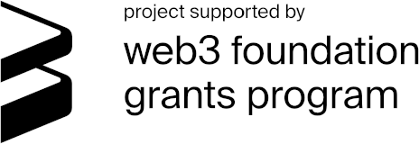

<h1 align="center"><br>
    <a href="https://perun.network/"></a>
<br></h1>

<h4 align="center">Perun Polkadot Pallet</h4>

<p align="center">
  <a href="https://www.apache.org/licenses/LICENSE-2.0.txt"></a>
  <a href="https://github.com/perun-network/perun-polkadot-pallet/actions/workflows/rust.yml"></a>
</p>

*Perun Polkadot Pallet* provides [go-perun] state channels for all Substrate compatible blockchains.  
Using it in your blockchain means to include it just like any other Substrate Pallet.  
[Perun Polkadot Node] demonstrates this with a minimal approach.

## Repo Structure

* `src/`
  * [lib.rs] pallet logic
  * [types.rs] type definitions
* `tests/`
  * `common/`
    * [mock.rs] test configuration
    * [utils.rs] test helpers
  * [unit.rs] pallet unit tests
  * [conclude.rs], [deposit.rs], [dispute.rs], [withdraw.rs] function unit tests
* [Cargo.toml] module info and dependencies

## Protocol

A state channel is opened by depositing funds for it into the pallet by calling *Deposit*.  
The participants of the channel can then do as many off-chain channel updates as they want.  
When all participants come to the conclusion that the channel should be closed, one will call *ConcludeFinal*.  
All of them can then withdraw the outcome with *Withdraw*, which closes the channel.  

*Dispute* and *ConcludeDispute* are only needed for the dispute case and allow every participant to enforce the last valid state.  
A dispute can be resolved after a timeout or with a valid state via *ConcludeDispute*.  
All participants can then withdrawn their funds just as in the honest case.

### State diagram

```pre
           ┌────────┐                 ┌─────────────┐            ┌─────────────┐
  Deposit  │        │  ConcludeFinal  │             │  Withdraw  │             │
──────────►│  OPEN  ├────────────────►│  CONCLUDED  ├───────────►│  WITHDRAWN  │
           │        │                 │             │            │             │
           └───┬────┘                 └─────────────┘            └─────────────┘
               │                             ▲
               │                             │
            Dispute                          │
               │                             │
               │                             │
               ▼                             │
           ┌────────┐                        │
     ┌─────┤        │  ConcludeDispute       │
  Dis│pute │DISPUTED├────────────────────────┘
     └────►│        │
           └────────┘
```

### Functions and Types

Functions
- **Deposit(funding_id, amount)** allows a participant to transfer funds into a channel. It is called by each channel participant in order to open the channel.
- **ConcludeFinal(params, state, sigs)** collaboratively closes a channel in one step. Only works if all participants signed the state.
- **Dispute(params, state, sigs)** opens a dispute with the passed *state*. Only works if all participants signed the state.
- **ConcludeDispute(params, channel_id)** concludes a dispute after its timeout ran out.
- **Withdraw(withdrawal, sig)** withdraws the outcome of a channel of a single participants. All participants can call this function after the channel is concluded.

Types
- **Params** defines the constant configuration of a channel.
- **State** represents the an off-chain state of a channel.
- **Withdrawal** authorizes an on-chain funds of channel balances.
- **RegisteredState** stores a dispute.
- **Channel ID** (aka *channel_id*) uniquely identifies a channel. Calculated as `Hash(params)`.
- **Funding ID** (aka *funding_id*) uniquely identifies a participant in a channel. Calculated as `Hash(channel_id|participant)`.


## Usage

Example usage of this Pallet is demonstrated in the [Perun Polkadot Node] repo.
### Tests

The tests can be run with:
```bash
cargo test --all-features
```

or in docker:

```bash
# Run this each time you change something.
docker build -t perun .
docker run --rm perun
```

### Documentation

The in-code documentation can be opened with:

```bash
cargo doc --no-deps --open --package pallet-perun
```

## Funding

This project is developed for an [Open Grant] from the [Web3 Foundation] [Open Grants Program].  
It is additionally supported by the the German Ministry of Education and Science (BMBF) through a Startup Secure grant.  
<p align="center">
<a href="https://web3.foundation/about/"></a>
<a href="https://www.bmbf.de/"></a>
</p>

## Known issues

- It is possible to dispute unfunded channels. This could be used to inflate the on-chain state.
- The used `StorageMaps` do not use a prefix and could therefore collide. This can only happen with negligible probability.

## TODOs

- Weight estimations are missing
- Only one currency can currently be used per channel. Multi-Currency channels are supported by *go-perun* so having them here would be nice.
- Walking blocks instead of setting the time should be preferred in testing.
- Find out if it is dangerous to have state-modifying functions in not-`#[pallet::call]` functions.
- Add codecov once the repo is public.

## Security Disclaimer

This software is still under development.
The authors take no responsibility for any loss of digital assets or other damage caused by the use of it.
## Copyright

Copyright 2021 PolyCrypt GmbH.  
Use of the source code is governed by the Apache 2.0 license that can be found in the [LICENSE file](LICENSE).

<!--- Links -->

[go-perun]: https://github.com/hyperledger-labs/go-perun
[Perun Pallet]: https://github.com/perun-network/perun-polkadot-pallet
[node template]: https://github.com/substrate-developer-hub/substrate-node-template
[frontend template]: https://github.com/substrate-developer-hub/substrate-front-end-template

[Perun Polkadot Node]: https://github.com/perun-network/perun-polkadot-node
[Open Grant]: https://github.com/perun-network/Open-Grants-Program/blob/master/applications/perun_channels.md#w3f-open-grant-proposal
[Web3 Foundation]: https://web3.foundation/about/
[Open Grants Program]: https://github.com/w3f/Open-Grants-Program#open-grants-program-

[lib.rs]: src/lib.rs
[types.rs]: src/types.rs
[utils.rs]: tests/common/utils.rs
[mock.rs]: tests/common/mock.rs
[unit.rs]: tests/unit.rs
[conclude.rs]: tests/conclude.rs
[deposit.rs]: tests/deposit.rs
[dispute.rs]: tests/dispute.rs
[withdraw.rs]: tests/withdraw.rs
[Cargo.toml]: Cargo.toml
